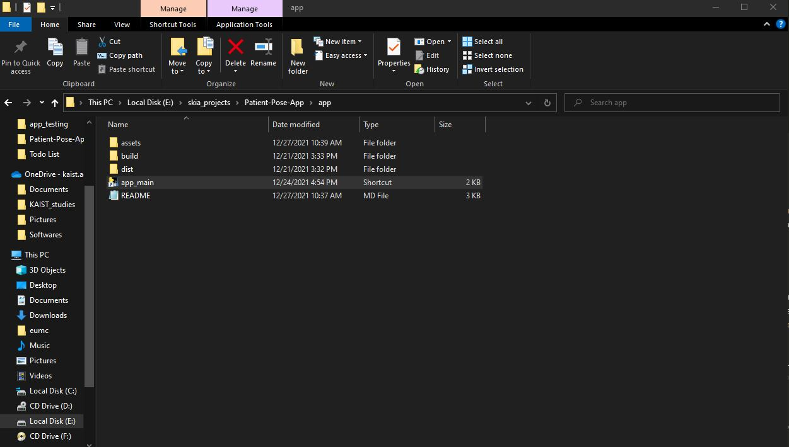
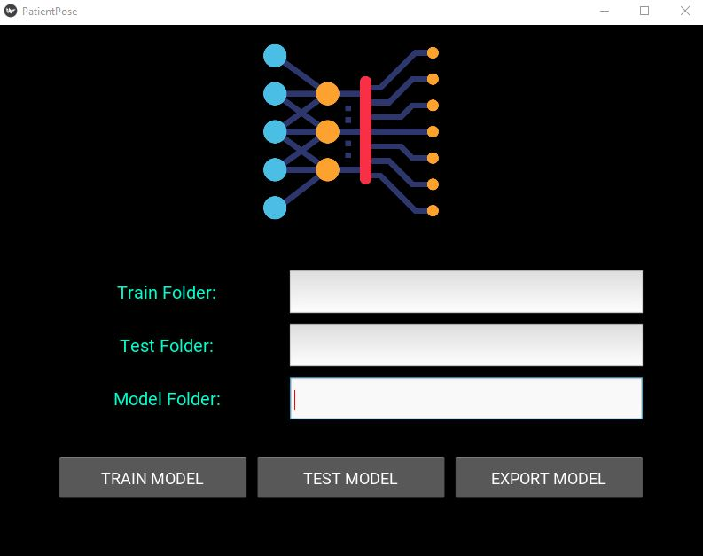
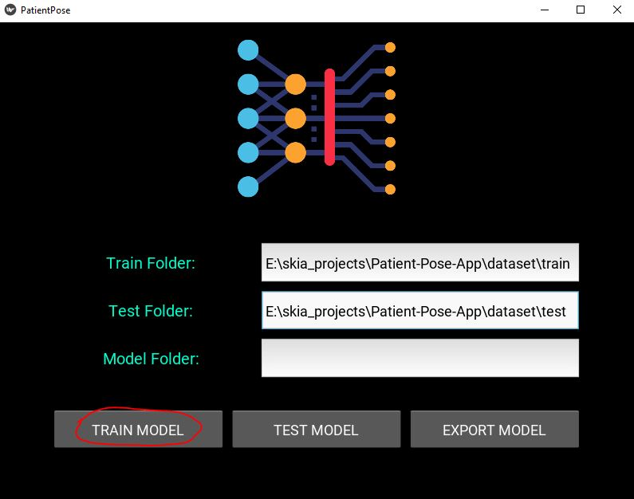
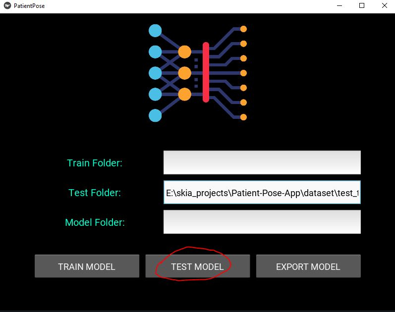
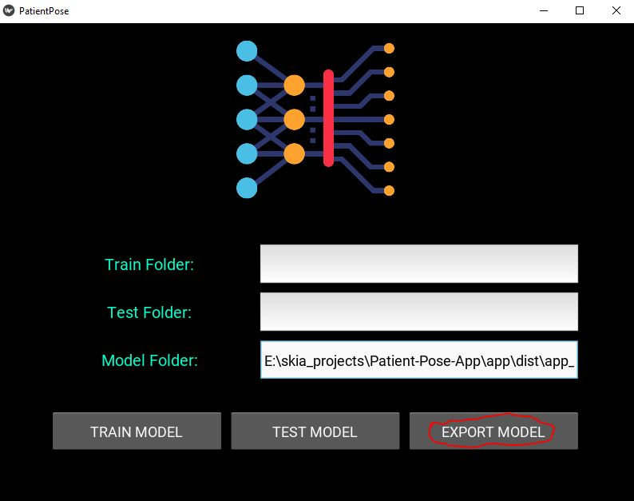

# Overview
A GUI framework for patient pose estimation based on `PyTorch` and `Kivy`. Main parts are developing GUI using `Kivy` library in python, packaging it as an executable using `pyinstaller`, and then using the app.

# Setup
Install the required packages using `requirement.txt` inside your conda environment or create environment using `environment.yml` file.
```console
pip install -r requirements.txt
```

Make sure to have all the requried scripts like train, test, dataloader and export in the same folder as app .py file. In my case, this app is based on the project for detecting **Patients Pose** using deep learning in `PyTorch`. So I copied my scripts from that [project](https://github.com/pytholic/Patient_Pose_Detection_Depth_Images/tree/main/Implementation).

# GUI dev
After that we make two main files names `app_main.py` and `design.kv`. We use Kivy design language to design our GUI and define overall layout inside `design.kv` file. The design basically includes some `input fields` and some `buttons`. 

Then in the `app_main.py` we define some functions that we attach to our `buttons`. These functions also run our deep learning scripts from `train.py`, `test.py`, and `export.py` files.

# Packaging
After the design phase, copy all the required files i.e. `logo.png`, `app_main.py`, `design.kv` and other pytorch scripts inside a new folder. After that open terminal and activate your conda environments in this folder.
## Step 1
Run 
```
pyinstaller app_main.py -w
```
**Note:** The `-w` flag is to hide the console. However if you need to see some outputs or training process on the console, then don't use this flag.

After running the above command, we see two new folder `build` and `dist`. Locate `.exe.` file at `dist\app_main\app_main.exe` and run it. You will notice that the app closes instantly. The reason is that we packaged everything for `app_main.py` file, but we did not do anything for our `design.kv` file which is the most important one.

## Step 2
We also have a new file named `app_main.spec`, and we need to make changes to this file. 

Folowing lines were added

1. Adding sdl2 and glew imports
```
from kivy_deps import sdl2, glew
```

2. Adding `datas` and `hiddenimports` for pytorch and other libraries which are necessary for the project.
```
datas=[("./resources/logo.png", '.'), 
             (os.path.join(PATH, "torch"), "torch"),
             (os.path.join(PATH, "torchvision"), "torchvision"),
             (os.path.join(PATH, "kivy"), "kivy"),
             (os.path.join(PATH, "onnx"), "onnx"),
             (os.path.join(PATH, "numpy"), "numpy"),
             (os.path.join(PATH, "sklearn"), "sklearn")],
             hiddenimports=["sklearn", "onnx", "numpy", "torch", "torchvision", "kivy"],
```

3. Adding design file data
```
a.datas += [('Code\design.kv', 'E:\\skia_projects\\Patient-Pose-App\\app_dev\\app_testing\\design.kv', 'DATA')]
```

4. Adding `Tree` structure
```
coll = COLLECT(exe,
               Tree('E:\\skia_projects\\Patient-Pose-App\\app_dev\\app_testing\\'),
               a.binaries,
               a.zipfiles,
               a.datas, 
               *[Tree(p) for p in (sdl2.dep_bins + glew.dep_bins)],
               strip=False,
               upx=True,
               upx_exclude=[],
               name='app_main')
```

## Step 3
Run
```console
pyinstaller app_main.py -y
```

# Using the framework
Following steps show some guidelines to use the framework.

## Folder Structure
Before you begin using the framework, make sure your data folder structure looks like this.

```console
|-- dataset
    |-- train
        |-- head_left
            |-- img1
            |-- img2
            |-- .
        |-- head_right
            |-- img1
            |-- img2
            |-- .
        |-- none
            |-- img1
            |-- img2
            |-- .
        |-- standing
            |-- img1
            |-- img2 
            |-- .
    |-- test # used for validation during training
        |-- head_left
            |-- img1
            |-- img2
            |-- .
        |-- head_right
            |-- img1
            |-- img2
            |-- .
        |-- none
            |-- img1
            |-- img2
            |-- .
        |-- standing
            |-- img1
            |-- img2 
            |-- .
    |-- test_pred # used for testing on images
        |-- img1
        |-- img2
        |-- .
```

## Usage
Run `dist\app_main\app_main.exe`. This will start the GUI app alongwith a console. You can create a shortcut of `app_main.exe` for your convenience.
<p align="center">
  
</p>

<p align="center">
  
</p>

### Training
To **train** the model on your data, copy the paths of your `train` and `test` folder and paste them in the `Train Folder` and `Test Folder` input dialogs in the app respectively. Then click on `TRAIN MODEL` and it will start training. You can also visualize the training output and loss in the `console`.

Note that after the training ends, the final `models` are stored at `dist\app_main\models`.

<p align="center">
  
</p>

### Testing
To perform **inference** using the trained model on test data, run the app and write the path of your test images in the `Test Folder` dialog. After that enter the location of your model folder in the `Model Folder` dialog. If you do not enter the model location, then the program will automatically use the model from the folder which was created in the training step i.e. `dist\app_main\models`.

<p align="center">
  
</p>

### Exporting the model
To export the model to `onnx` format, enter the path for input PyTorch model in the `Model Folder`. If you do not enter the model location, then the program will automatically use the model from the folder which was created in the training step i.e. `dist\app_main\models`. The output `onnx` model is stored in the same input folder.
#### **Note**
Currently `CoreML` export is only supported on **macOS** and **Ubuntu**, but not on **Windows**. So we have to do that separately.

<p align="center">
  
</p>

## Important Notes
* While a process is running i.e. training, testing, or model export, try not to click on the app window as it might result in a crash. When the program execution is finished, you will either get a `finished` message in the console, or the input path fields in the `Train Fodler`, `Test Folder`, or `Model Folder` will disappear.
* Make sure that your `PATHS` do not contain any **Korean** characters.

# Useful links
* https://www.youtube.com/watch?v=k4QCoS-hj-s&list=PLCC34OHNcOtpz7PJQ7Tv7hqFBP_xDDjqg&index=5

* https://www.youtube.com/watch?v=NEko7jWYKiE&list=PLCC34OHNcOtpz7PJQ7Tv7hqFBP_xDDjqg&index=20
